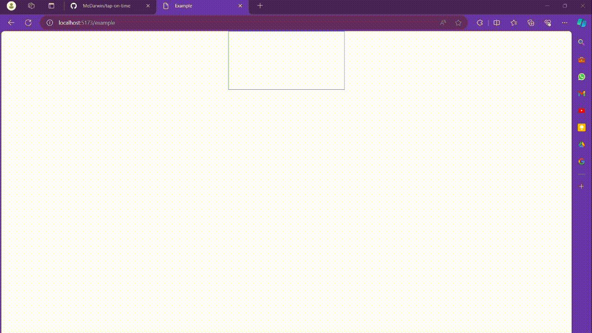

# Repository Documentation

This is a [vite](https://vitejs.dev/) project bootstrapped with `npm create vite@latest`.

This app is heavily depends on JS module and JS ES6.

Run `npm install` to install all depedencies.

## Run app

to run app with development server:

```bash
npm run dev
# or
yarn dev
# or
pnpm dev
# or
bun dev
```

Open [http://localhost:5173](http://localhost:5173/) with your browser to see the result.

## Making JSCanvas Game

Here we'll be learning how to make a JSCanvas game, my way.

### Making game scene

After doing some cleanups, make a new folder inside script (e.g scene) to group all game object. I use scene because it's smiliar to Unity's folder structures (scene based game object).

```bash
/
├── ...
├── script/
│   ├── scene/
│   └── main.js
└── ...
```

You may also use any folder structure as you will.

Inside the scene, there we place all game object like player, background, bot, enemy, etc.

Before making any game scene, it's best to make one main scene to control all other scene. I'll be using `startScene.js` as my main scene.

```javascript
export class StartScene {
  constructor(canvas, ctx) {
    this.ctx = ctx;
    //init other properties
  }
  draw() {
    //draw other scene
  }
  update() {
    //watch for update on other scene
  }
  // OTHER METHODS OMITTED FOR SIMPLICITY
}

```

`startScene.js` act like a container of the game. Any game object will be initialized inside it.

### Basic to JsCanvas

After we're done with main scene, we can make other game object by making another game scene. File naming is up to you but I personally like to stick with one naming convention to reduce confusion and more meaningful names.

Before we dive in into the actual code, we must know main component in JS Canvas game making. Usually there are two main method; `draw()` and `update()`. Which I will explain shortly.

#### `draw()`

`draw()` is a method that tells the scene what to draw inside the canvas. They include X and Y of the canvas location as to where to draw and also what object to draw.

Here is a demo use of `draw()` method to draw a red rectangle.

```javascript
class GameScene{
//...

  draw() {
    this.game.ctx.save(); // save canvas context to keep current canvas's condition (rotate, translate, etc.)
    this.game.ctx.fillStyle = "red"; // change attribute of canvas's context fillStyle to the desired color
    this.game.ctx.fillRect(/* x value */ 20, /* y value */ 15, /* width */ 10, /* height*/ 10); // create a 10x10 red cube at (20, 15)
    this.game.ctx.restore(); // restore the canvas context to saved state
  }

//...
}
```

#### `update()`

what is `update()`? We may already have a method that keeps drawing itslef, but what about updating current condition like moving, hit, and jump? That's where `update()` take control. You actually can use just one method but it's more convenient this way. These method will be separated by its usage; one for drawing and other for updating conditions.

Demo of `update()` that constantly increment the `x` prop of a class. Thus, making the object drawn always move.

```javascript
class GameScene{
  constructor() {
    this.speed = 1;
    this.x = 1;
    this.y = 10;
  }

  //...

  update() {
    this.move(); // always do move per frame
  }

 /**
  * Moves the sprite by its speed.
  */
  move() {
    this.x += this.speed;
  }

  //...
}
```

In the example above, the game object is moving 1px per frame as defined. The `x` property then used by `draw()` method as the `x` parameter. Making the `draw()` always draw horizontally 1px more than the previous position.

Another thing that I usually do is move every sub-function of the update condition into its own method. That way, the code will be easier to read, maintain, and debug. Just as I did with `move()`.

#### `constructor()`

`constructor()` will always be executed firstly, initializing all props inside it. In JsCanvas, constructor have a big role in terms of connecting the scene to one another. Making them able to "communicate" their current state.

Mainly, `constructor()` is used to pass the game itself. By doing so, any child class will have the parent instance (main scene).

Here is an example of making two class able to access each other props by passing the game to the `constructor()`.

```javascript
class ExampleParent{
  constructor(){
    this.positionClass = new PositionClass(this)
    this.childClassOne = new ChildClassOne(this)
  }
}

class ChildClassOne{
  constructor(game){
    this.game = game
    this.x = this.game.positionClass.x //<-- this will get 10 as value, from Position class `x` prop
  }
}

class PositionClass{
  constructor(game){
    this.game = game
    this.x = 10
    this.y = 10
  }
}
```

By utilizing `constructor()` this way, it is possible to pass properties from siblings to siblings through parent class. An example usage of this: object intersection, object collision, player lifes, and many more.

#### Starting the animation

In JsCanvas, we have to manually animate it. There are no engine used here, although you can use any if you want (e.g PhaserJS).

There are two method I know in how to animate the canvas:

1. `setInterval()`
   The code is as seen.

   ```javascript
   setInterval(() => {
       // --- JS CANVAS ANIMATION FUNCTION ---
   }, /* how many ms per interval */ 200);
   ```

   *I rarely use `setInterval()`. Very sorry for the short example.**
2. `requestAnimationFrame()`

   ```javascript
   // the function that will loop over and over
   const animate = () => {
     requestAnimationFrame(animate); //request loop animation
     now = Date.now(); //get current timestamp
     elapsed = now - then; //get elapsed time since last frame

     // Check whether elapsed has passed fps interval
     if (elapsed > fpsInterval) {
       // Clear the canvas every frame
       ctx.clearRect(0, 0, canvas.clientWidth, canvas.clientHeight);

       // --- JS CANVAS ANIMATION FUNCTION ---

       // Set `now` to `then` (as the canvas has changed frame) and tolerate miscalculated time
       then = now - (elapsed % fpsInterval); 
     }
   };

   // to init the animation
   const startAnimate = (fps = 1) => {
     fpsInterval = ONE_SECOND_IN_MS / fps; // Get how much time should elapse between each frame
     initTime = then = Date.now(); //set initTime
     animate(); // Call the animate func to start the game
   };

   // most of the time, you want the animation to start after all the dom content loaded.
   document.addEventListener("DOMContentLoaded", startAnimate(45)); //animate with 45 fps
   ```

   You may be wondering, "isn't it more complicated this way?". Well, yeah. However, this is the most optimized and recommended way to loop an animation over and over again.

### Full example of JsCanvas basic

#### `example.html`

```html
<!-- example.html -->

<!DOCTYPE html>
<html data-theme="light" lang="en">
<head>
    <meta charset="UTF-8">
    <meta name="viewport" content="width=device-width, initial-scale=1.0">
    <link rel="stylesheet" href="./css/style.css" />
    <title>Example</title>
</head>
<body>
    <canvas class="absolute border border-blue-500 left-1/2 -translate-x-1/2" id="cvs"></canvas>
    <script src="./script/example.js"></script>
</body>
</html>
```

#### `example.js`

```javascript
//example.js

let fpsInterval, initTime, now, then, elapsed; // all requirements for animation
const ONE_SECOND_IN_MS = 1000;
const /** @type {HTMLCanvasElement} */ canvas = document.getElementById("cvs");
const /** @type {CanvasRenderingContext2D} */ ctx = canvas.getContext("2d");

class MainClass {
  constructor() {
    this.position = new PositionClass(this); // create a position class instance
    this.cube = new CubeClass(this); // create a cube class instance
  }
  draw() {
    this.cube.draw(); // draw the cube
  }
  update() {
    this.cube.update(); // update the cube
  }
}
class PositionClass {
  constructor(game) {
    this.game = game;
    this.x = 0;
    this.y = 0;
  }
}
class CubeClass {
  constructor(game) {
    this.game = game;
    this.color = "red";
    this.size = 10;
  }
  draw() {
    ctx.fillStyle = this.color; // change the fill style to the desired color
    ctx.fillRect(this.game.position.x, this.game.position.y, this.size, this.size); // create a 10x10 red cube at position (x, y)
  }
  update() {
    this.game.position.x += 1; // move the cube 1 pixel to the right
  }
}

const main = new MainClass(); // init the main class

const animate = () => {
  requestAnimationFrame(animate); //request loop animation
  now = Date.now(); //get current timestamp
  elapsed = now - then; //get elapsed time since last frame

  // Check whether elapsed has passed fps interval
  if (elapsed > fpsInterval) {
    // Clear the canvas every frame
    ctx.clearRect(0, 0, canvas.clientWidth, canvas.clientHeight);
    // Draw the game scene and update the game scene each frame
    main.draw();
    main.update();

    then = now - (elapsed % fpsInterval); // Set `now` to `then` (as the canvas has changed frame) and tolerate miscalculated time
  }
};

const startAnimate = (fps = 1) => {
  fpsInterval = ONE_SECOND_IN_MS / fps; // Get how much time should elapse between each frame
  initTime = then = Date.now();
  animate(); // Call the animate func to start the game
};

document.addEventListener("DOMContentLoaded", startAnimate(45)); //animate with 45 fps
```

#### Result



Or visit [http://localhost:5173/example](http://localhost:5173/example) if the server is running. (only work in development server)
